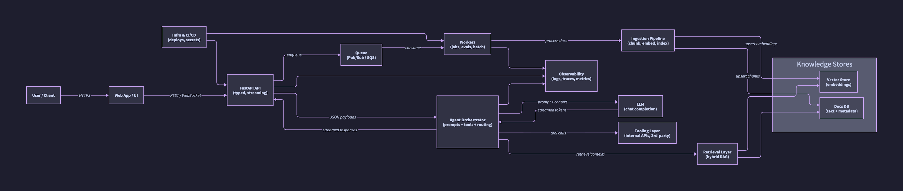

# Production-Grade AI Agent Stack 

Building a transparent, production-ready virtual assistant stack in public: from web UI to retrieval, tool-use, observability, and CI/CD. Follow along for real-world patterns, not demos.



## What this is
- Public journey of shipping an end-to-end agent platform.
- Focused on reliability, observability, secure config, and repeatable deployments.
- Regular updates with design notes, benchmarks, and failure postmortems.

## Architecture (from the diagram)
- Web App UI → FastAPI API (REST/WebSocket) with streaming responses.
- Infra & CI/CD guardrails: deploys, secrets, rollbacks.
- Queue (Pub/Sub/SQS) for async/parallel work; workers for jobs/metrics.
- Agent Orchestrator: prompt routing, tool chaining, JSON payloads, streamed replies.
- LLM calls + Tooling Layer (internal APIs, 3rd-party tools).
- Retrieval Layer (hybrid RAG) over Knowledge Stores: vector DB (embeddings) + docs DB (text+metadata).
- Ingestion Pipeline (chunks, embeds, index) feeding the stores.
- Observability everywhere: logs, traces, metrics.

## Roadmap
- [ ] Stand up API skeleton (typing, auth, streaming).
- [ ] Observability baseline (structured logs, tracing, metrics).
- [ ] Retrieval + ingestion pipeline (chunking, embeddings, hybrid search).
- [ ] Agent orchestration patterns (tool routing, retries, guards).
- [ ] Frontend for fast UX + live streaming.
- [ ] CI/CD with lint/tests, env templates, deploy scripts.
- [ ] Benchmarks, evals, and red-team scenarios.

## Principles
- Production-first: error budgets, retries, circuit breakers, timeouts.
- Secure-by-default: no secrets in repo; `.env.example` + secret manager usage.
- Reproducible: pinned deps, make/just tasks, CI parity with local.
- Observable: every hop emits traces/metrics/logs.

## How to follow
- Regular repo updates; threads on X for milestones and lessons.
- Issues will track work items; PRs welcome once the baseline lands.

## Status
- Kickoff ✅: diagram + plan in place.
- Backend scaffold ✅: FastAPI app with `/health` and `/agent/query`. The agent endpoint uses `openai-agents` and pulls the OpenAI API key from GCP Secret Manager (no secrets in repo), keyed by `GCP_PROJECT_ID` + secret name.

## Next steps (options under evaluation)
- **Output guardrails**: JSON schema/Pydantic validation; retries/repair; OpenAI JSON mode; Guardrails.ai/Outlines; moderation/safety filters (OpenAI/Vertex/custom regex); risk-based escalation to human/clarify.
- **Prompts + grounding**: versioned prompt templates; RAG with hybrid search (pgvector/Pinecone/Qdrant/Weaviate); retrieval scoring gates; schema checks before output; fallbacks when context is weak.
- **Structured autonomy**: LangGraph/state machines for planning; tool allowlists with input/output validation and rate limits; step/depth caps; scoped memory (conversation window + summaries + retrieval memory); dead-end detection with graceful handoff.

## Observability & Analytics Plan

This system is designed as a multi-tenant, agentic AI platform built with the OpenAI Agents SDK. From day one, it treats observability as a first-class feature, not an afterthought.

---

### 1. Observability Goals

We optimize for:
1. End-to-end traceability
   - Any user query can be followed from HTTP request → agent graph → LLM calls → tools → DB.
   - We can answer “what happened here?” in one or two hops.
2. Multi-tenant transparency
   - Every event is tagged with tenant_id and trace_id.
   - Tenants can see only their own conversations and analytics via RLS.
3. Operational reliability
   - Metrics and logs let us detect:
     - latency spikes,
     - error rate increases,
     - cost anomalies,
     - tool failures.
4. Quality & safety
   - Evals (offline + online) capture correctness, helpfulness, and safety.
   - This feeds back into model, prompt, and agent graph iteration.
5. Governance & compliance
   - Full audit logs and conversations stored per tenant.
   - Strong access control via RLS; future-proof knobs for retention/redaction.

---

### 2. Components & Responsibilities

We deliberately separate data types and sinks:
- LangSmith
  - Canonical source for LLM/agent/tool traces, prompt & agent graph versions, and eval runs.
  - Used for deep debugging and experiment/eval analysis.
- OpenTelemetry → Prometheus → Grafana
  - Metrics pipeline.
  - Infrastructure & application metrics (latency, error rate, throughput, cost per interval, etc.).
  - Grafana dashboards + alerts over Prometheus.
- JSON Logs → Logging backend (e.g., Cloud Logging, Loki – implementation-specific)
  - Application logs in structured JSON.
  - Includes event type, severity, and context (tenant/trace/conversation IDs).
  - Optimized for searchability during incidents.
- Postgres + RLS
  - Domain data & analytics:
    - Conversations and messages (full text).
    - Tool usage events.
    - Per-conversation eval summaries.
    - Per-tenant analytics (messages/day, tool usage, costs, etc.).
    - Enforced Row-Level Security (RLS) for multi-tenancy.

This separation is intentional:
- Logs and traces are optimized for debugging and infra ops.
- Postgres is optimized for product features (tenant dashboards, audit views).
- LangSmith is optimized for LLM-specific visibility & evals.

---

### 3. Identity & Multi-Tenant Model

We standardize on a shared identity model across all components:
- tenant_id – UUID identifying the tenant (company/account).
- user_id – UUID for the user within a tenant.
- conversation_id – UUID for a logical conversation thread (one “chat session”).
- request_id – unique ID for each HTTP request.
- trace_id – OpenTelemetry trace ID, used to correlate across logs/metrics/traces.
- agent_name – name of the agent node handling a step.
- Versioning fields:
  - model_version
  - prompt_version
  - agent_graph_version
  - experiment_id (nullable; used for A/B tests/experiments).

Rules:
- Every conversational message, tool call, LLM call, and analytics row includes:
  - tenant_id and trace_id
  - plus conversation_id where applicable.
- LangSmith traces and OTel spans attach:
  - tenant_id, conversation_id, request_id, agent_name, and version fields as attributes.

This makes it trivial to:
- Start from a tenant’s conversation in the UI → jump to the LangSmith trace → correlate with Grafana metrics and raw logs.
- Slice metrics and analytics by tenant, model version, prompt version, etc.

RLS Strategy
- Postgres enforces multi-tenant isolation via RLS:
- On each request, the backend sets: SET app.current_tenant = '<tenant_uuid>';
- RLS policies are defined as:

```
USING (tenant_id = current_setting('app.current_tenant')::uuid)
```

- Only platform admins (e.g., internal operators) can bypass RLS, and only via dedicated admin paths.

---

### 4. Tracing

We combine:
1. OpenAI Agents SDK Traces → LangSmith
2. OpenTelemetry Distributed Traces → tracing backend (Jaeger/Tempo/etc.)

#### 4.1 Agents + LangSmith
- The Agent framework (OpenAI Agents SDK) is configured to:
  - Emit step-by-step traces for:
    - planner/router decisions,
    - LLM calls,
    - tool invocations,
    - final response.
  - Push these traces to LangSmith, including:
    - tenant_id, conversation_id, trace_id,
    - agent_name,
    - version fields.

Why:
LangSmith is specialized for LLM/agent workflows:
- You get a tree/graph view of each interaction.
- You can compare behaviors across versions and eval runs.
- This is the primary debugging UI for AI-specific logic (prompting, tool selection, etc.).

#### 4.2 OpenTelemetry Traces
- The API server and tools are instrumented with OpenTelemetry.
- For each incoming HTTP request:
  - Start a root span (/chat, /agent/execute, etc.).
  - Attach attributes: tenant_id, user_id, conversation_id, request_id, trace_id.
- Child spans are created for:
  - downstream HTTP calls,
  - DB queries,
  - tool invocations,
  - LLM calls (when not already captured by the agent framework).
- The trace_id from OTel is propagated into:
  - JSON logs (as a field),
  - LangSmith (as a custom attribute).

We use 100% tracing (no sampling) because:
- This is a low-to-moderate traffic demo system.
- Full traces drastically simplify debugging and analysis.
- Sampling can be introduced later if needed without changing the trace schema.

Failure mode:
Tracing is best-effort. If the tracing backend is unavailable or rate-limited, we never fail user requests; we simply drop spans.

---

### 5. Structured Logging

All application logs are structured JSON, written to the logging backend.

Each log event includes:
- timestamp
- level – INFO, WARN, or ERROR
- event_type – a small, well-defined enum, e.g.:
  - REQUEST_RECEIVED
  - AGENT_DECISION
  - TOOL_CALL_START / TOOL_CALL_END
  - LLM_CALL
  - GUARDRAIL_TRIGGERED
  - RESPONSE_SENT
  - EVAL_RUN
- Context fields:
  - tenant_id, user_id, conversation_id, request_id, trace_id
  - agent_name, tool_name, model_name
  - prompt_version, agent_graph_version, experiment_id

Log Levels
- INFO
  - Normal flow events (request received, tool call completed, response sent).
- WARN
  - Soft failures or degraded behavior (tool retries, timeouts with fallback, partial responses).
- ERROR
  - Hard failures (uncaught exceptions, 5xx responses, failed tool calls with no fallback).

Why structured logs?
- JSON logs are machine-parsable and make it easy to:
  - filter by tenant_id,
  - search for event_type="ERROR",
  - correlate with trace_id in tracing/metrics.

Always-on logging:
- We always log all events (no sampling).
- Volume is manageable at expected traffic levels.

---

### 6. Metrics: Prometheus & Grafana

Metrics are exposed via OpenTelemetry and scraped by Prometheus. Grafana is used for dashboards and alerts.

#### 6.1 Core Metrics

We track metrics at both system and per-tenant levels. Typical metrics:
- Request-level
  - ai_requests_total{tenant_id, route, model_name}
  - ai_request_latency_ms_bucket{tenant_id, route} + p50/p95/p99 in Grafana
- LLM usage & cost
  - ai_tokens_input_total{tenant_id, model_name}
  - ai_tokens_output_total{tenant_id, model_name}
  - ai_cost_usd_total{tenant_id, model_name}
- Errors
  - ai_errors_total{tenant_id, route, error_type}
  - tool_errors_total{tenant_id, tool_name, error_type}
- Tool performance
  - tool_latency_ms_bucket{tenant_id, tool_name}
  - tool_calls_total{tenant_id, tool_name}

Metrics are attached with:
- tenant_id
- model_name
- tool_name
- env (dev/staging/prod)

#### 6.2 Dashboards & Alerts

Typical Grafana dashboards:
- Overview
  - Request rate, error rate, latency (global + per-tenant).
- LLM Usage
  - Tokens and cost over time per tenant and model.
- Tools
  - Tool call counts and error rates per tool and tenant.

Alerts:
- Error rate exceeds a threshold over a window (e.g., > 5% over 5 minutes).
- Latency p95 above SLO.
- Cost anomalies (e.g., sudden spike in ai_cost_usd_total for a tenant).

Why metrics + dashboards?
- Fast feedback on health and performance.
- Ability to spot regressions immediately after deployments or agent/prompt changes.

---

### 7. Evals & Quality Monitoring

We measure model/agent quality via offline and online evals.

#### 7.1 Offline Evals
- A nightly job:
  - Samples conversations (via LangSmith traces) for the previous period.
  - Runs evaluators (LLM-as-judge + rule-based) on:
    - correctness,
    - helpfulness,
    - safety (toxicity/PII),
    - tool-use quality (right tool, minimal hops).
  - Writes eval summaries to Postgres, in an eval_summaries table:
    - tenant_id
    - conversation_id
    - trace_id
    - eval_score_correctness (0–1)
    - eval_score_helpfulness (0–1)
    - eval_score_safety (0–1)
    - eval_flags (e.g., “potential_hallucination”, “safety_violation”)

LangSmith remains the canonical store for full eval runs; Postgres holds normalized summaries to drive tenant analytics.

#### 7.2 Online Evals
- Optionally, a small percentage of live requests (e.g., 5–10%) are evaluated inline or asynchronously:
  - After the response, an eval job scores the answer and writes to eval_summaries.
  - User feedback (thumbs up/down, tags, comments) is also stored in Postgres and linked via trace_id and conversation_id.

Why store evals in Postgres as well?
- Tenants can see not just volume and cost, but answer quality over time.
- Product decisions can be driven by quality trends (e.g., one tenant’s prompts or workflows may be underperforming).

---

### 8. Governance, Audit Logs & Data Policies

This project is a production-grade demo, so by default we:
- Store raw PII and full conversation text in Postgres.
- Retain data indefinitely (no automated deletion yet).
- Provide a per-tenant delete mechanism (e.g., “delete all my data”) that:
  - removes conversations/messages/eval summaries for that tenant.

We do not provide export features at this stage.

#### 8.1 Audit Logging

Auditability is implemented via dedicated tables in Postgres:
- audit_events:
  - id
  - tenant_id
  - user_id (nullable for system-initiated)
  - trace_id
  - event_type (e.g., CONVERSATION_STARTED, MESSAGE_SENT, TOOL_EXECUTED, DATA_DELETED)
  - summary (short human-readable description)
  - created_at

Audit events are append-only.

#### 8.2 Future-Proofing (Retention & Redaction)

Even though we retain data indefinitely for the demo, the design includes config flags:
- RETENTION_DAYS (default: NULL = unlimited)
- REDACT_PII (default: false)

These can be used later to:
- Run a background job that deletes or pseudonymizes old conversations.
- Apply redaction rules before writing logs or messages.

This makes it straightforward to adapt the system to stricter production environments (e.g., healthcare, finance).

---

### 9. Tenant-Facing Analytics & UI

Tenants can log in and see only their own analytics and conversations.

#### 9.1 Core Tables (Postgres)

Example schema (conceptual):
- conversations
  - id (conversation_id)
  - tenant_id
  - user_id
  - started_at
  - ended_at
  - trace_id
  - model_name
  - prompt_version
  - agent_graph_version
  - experiment_id (nullable)
- messages
  - id
  - conversation_id
  - tenant_id
  - user_id (nullable for agent messages)
  - role (user | assistant | system | tool)
  - content (full text)
  - tool_name (nullable)
  - created_at
  - trace_id
- tool_usage
  - id
  - tenant_id
  - conversation_id
  - tool_name
  - success (bool)
  - latency_ms
  - used_at
  - trace_id
- usage_metrics (per-request metrics)
  - id
  - tenant_id
  - conversation_id
  - trace_id
  - tokens_input
  - tokens_output
  - cost_usd
  - latency_ms
  - created_at
- eval_summaries
  - as described in the eval section.

#### 9.2 Analytics Calculated On-The-Fly

Since this is not a high-traffic system, analytics are computed via SQL queries directly on these tables, e.g.:
- Messages per day:
  - COUNT(*) on messages grouped by DATE(created_at).
- Unique conversations:
  - COUNT(DISTINCT conversation_id) per day.
- Tool usage:
  - COUNT(*) on tool_usage grouped by tool_name.
- Cost per day:
  - SUM(cost_usd) from usage_metrics grouped by date.
- Average quality scores:
  - AVG(eval_score_correctness) from eval_summaries.

All queries are automatically scoped to tenant_id via RLS – tenants can never see data from other tenants.

#### 9.3 Tenant UI

The tenant dashboard can include:
- Overview cards:
  - Requests today
  - Active conversations
  - Tools used
  - Cost today / this month
  - Average eval scores
- Time series charts:
  - Messages per day
  - Cost per day
  - Eval score trends
- Tables:
  - Recent conversations with:
    - timestamp
    - model/prompt version
    - cost
    - eval summary
    - deep link to full conversation and troubleshooting trace (via trace_id).

This demonstrates to tenants (and to reviewers) that the system is observable by design, not just at the infra level but at the product level.

---

### 10. Environments

To avoid mixing data and debugging across environments:
- Environments: dev, staging, prod.
- Every log, trace, metric, and DB row includes:
  - env attribute/column where appropriate.
- Environments use separate databases and tracing/metrics projects where practical.

This makes it safe to run experiments and load tests in non-prod without polluting production analytics.

---

This observability & analytics design ensures:
- We can reconstruct any interaction with full context and cost.
- Tenants can audit and understand their own usage.
- We have all the hooks needed for future:
  - stricter compliance,
  - higher traffic (add sampling/aggregation),
  - and more advanced eval & optimization workflows.
